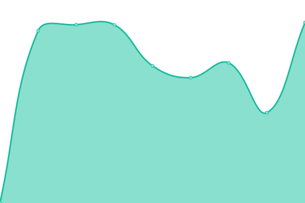
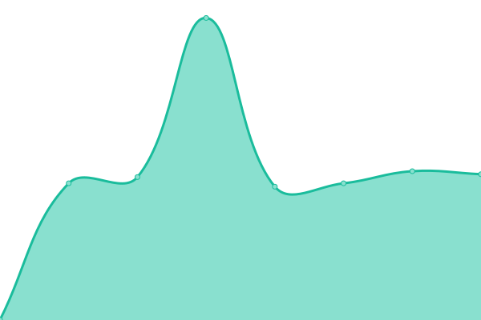
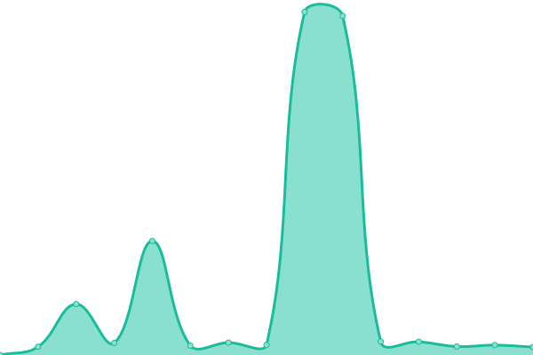

# [📈 Live Status](https://dimitrovleonardo.github.io/accesco): <!--live status--> **🟧 Partial outage**

This repository contains the open-source uptime monitor and status page for [dimitrovleonardo](https://dimitrovleonardo.github.io/accesco), powered by [Upptime](https://github.com/upptime/upptime).

With [Upptime](https://upptime.js.org), you can get your own unlimited and free uptime monitor and status page, powered entirely by a GitHub repository. We use [Issues](https://github.com/dimitrovleonardo/accesco/issues) as incident reports, [Actions](https://github.com/dimitrovleonardo/accesco/actions) as uptime monitors, and [Pages](https://dimitrovleonardo.github.io/accesco) for the status page.

<!--start: status pages-->
<!-- This summary is generated by Upptime (https://github.com/upptime/upptime) -->
<!-- Do not edit this manually, your changes will be overwritten -->
<!-- prettier-ignore -->
| URL | Status | History | Response Time | Uptime |
| --- | ------ | ------- | ------------- | ------ |
|  [Accesco](https://accesco.co) | 🟩 Up | [accesco.yml](https://github.com/dimitrovleonardo/accesco/commits/HEAD/history/accesco.yml) | 

 957ms
     
 | 

<a href="https://dimitrovleonardo.github.io/accesco/history/accesco">100.00%</a>
    

|  [Kardiologija](https://kardiologijazs.com) | 🟥 Down | [kardiologija.yml](https://github.com/dimitrovleonardo/accesco/commits/HEAD/history/kardiologija.yml) | 

 681ms
     
 | 

<a href="https://dimitrovleonardo.github.io/accesco/history/kardiologija">97.33%</a>
    

|  [Fullhauz](https://fullhauz.com) | 🟩 Up | [fullhauz.yml](https://github.com/dimitrovleonardo/accesco/commits/HEAD/history/fullhauz.yml) | 

 734ms
     
 | 

<a href="https://dimitrovleonardo.github.io/accesco/history/fullhauz">100.00%</a>
    

|  [Accesco s2](http://81.169.243.172) | 🟩 Up | [accesco-s2.yml](https://github.com/dimitrovleonardo/accesco/commits/HEAD/history/accesco-s2.yml) | 

 2313ms
     
 | 

<a href="https://dimitrovleonardo.github.io/accesco/history/accesco-s2">100.00%</a>
    

|  [Continental Dispatch Academy](https://continentaldispatchacademy.mk/) | 🟥 Down | [continental-dispatch-academy.yml](https://github.com/dimitrovleonardo/accesco/commits/HEAD/history/continental-dispatch-academy.yml) | 

 874ms
     
 | 

<a href="https://dimitrovleonardo.github.io/accesco/history/continental-dispatch-academy">100.00%</a>
    

|  [Youth-Led Activism Platform](https://yla-platform.eu/) | 🟩 Up | [youth-led-activism-platform.yml](https://github.com/dimitrovleonardo/accesco/commits/HEAD/history/youth-led-activism-platform.yml) | 

 1015ms
     
 | 

<a href="https://dimitrovleonardo.github.io/accesco/history/youth-led-activism-platform">100.00%</a>
    

<!--end: status pages-->

[**Visit our status website →**](https://dimitrovleonardo.github.io/accesco)

## 📄 License

- Powered by: [Upptime](https://github.com/upptime/upptime)
- Code: [MIT](./LICENSE) © [dimitrovleonardo](https://dimitrovleonardo.github.io/accesco)
- Data in the `./history` directory: [Open Database License](https://opendatacommons.org/licenses/odbl/1-0/)
